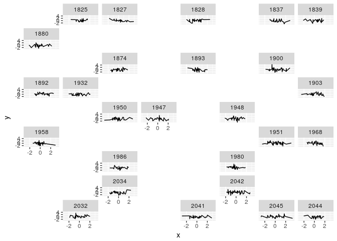

<!-- README.md is generated from README.Rmd. Please edit that file -->
gfmaker
=======

This packages takes a spatial-y thing and gives a rasterized row/col index of each object's centroid (the vertex-weighted inner centroid, I believe). The maximum dimensions of the grid can be controlled in the function `gfmaker`. It doesn't work well, because the best placement 'pseudo-geographically' is on a very fine grid, and this makes all the panels very small. If the grid is coarser it works fine but the geographic magic is very watered down.

The crux problem is that geofacet expects a full grid in row/col form, and the panels are expected to fill each cell completely. It would be better if a much finer grid could be specficied, with panels expanding to the space available to them (before touching othe panels)

If anyone is keen to work on this, let me know! I think this is good enough for my key purpose, which is a literal tiling of the southern ocean.

Installation
------------

You can install gfmaker from github with:

``` r
# install.packages("devtools")
devtools::install_github("mdsumner/gfmaker")
```

Example
-------

This is a basic example which shows you how to solve a common problem:

``` r
source("inst/examples/gfmap.R", echo = TRUE)
#> 
#> > library(geofacet)
#> 
#> > library(ggplot2)
#> 
#> > library(tibble)
#> 
#> > library(dplyr)
#> 
#> Attaching package: 'dplyr'
#> The following objects are masked from 'package:stats':
#> 
#>     filter, lag
#> The following objects are masked from 'package:base':
#> 
#>     intersect, setdiff, setequal, union
#> 
#> > data("wrld_simpl", package = "maptools")
#> 
#> > library(gfmaker)
#> 
#> > library(sf)
#> Linking to GEOS 3.5.1, GDAL 2.1.2, proj.4 4.9.3
#> 
#> > library(spdplyr)
#> Loading required package: sp
#> 
#> > map1 <- read_sf(system.file("shape/nc.shp", package = "sf"), 
#> +     quiet = TRUE)
#> 
#> > ind <- unique(unlist(st_touches(map1[unlist(st_touches(map1[40:41, 
#> +     ], map1)), ], map1)))
#> although coordinates are longitude/latitude, it is assumed that they are planar
#> although coordinates are longitude/latitude, it is assumed that they are planar
#> 
#> > map1 <- as(map1, "Spatial") %>% slice(ind)
#> 
#> > gf <- gfmaker(map1, code = as.character(map1$CNTY_ID), 
#> +     name = map1$NAME, max_dim = c(9, 8))
#> 
#> > gf <- distinct(gf, row, col, .keep_all = TRUE)
#> 
#> > nn <- 1000
#> 
#> > d <- tibble(x = rnorm(nn), y = rnorm(nn), label = sample(as.character(map1$CNTY_ID), 
#> +     nn, replace = TRUE)) %>% arrange(label)
#> 
#> > library(geofacet)
#> 
#> > library(ggplot2)
#> 
#> > ggplot(d, aes(x, y)) + geom_line() + facet_geo(~label, 
#> +     grid = gf %>% select(row, col, code, name))
#> You provided a user-specified grid. If this is a generally-useful
#>   grid, please consider submitting it to become a part of the
#>   geofacet package. You can do this easily by calling:
#>   grid_submit(__grid_df_name__)
```



    #> 
    #> > asp <- 1/cos(mean(gf$y_) * pi/180)
    #> 
    #> > plot(map1, main = "pure geography", asp = asp)


    #> 
    #> > plot(gf$col, 1 + max(gf$row) - gf$row, asp = asp, 
    #> +     main = "the generated grid")


